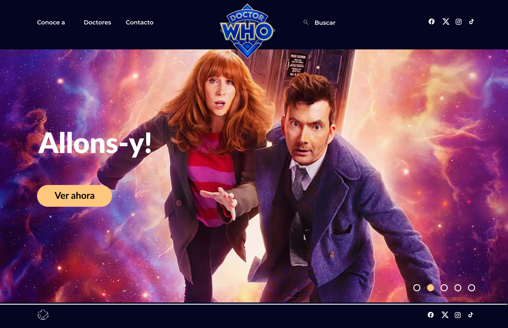
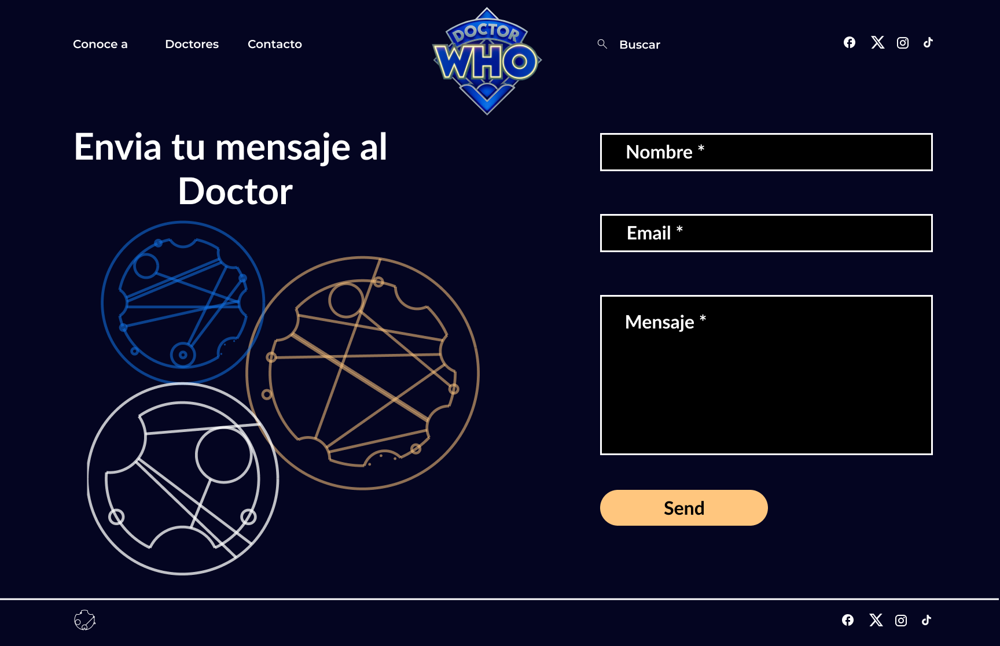

Doctor Who Landing Page

¡Bienvenidos a la Aventura del Doctor! ¡Explora el fascinante universo de Doctor Who a través de nuestra nueva landing page desarrollada con React.js y Next.js! Esta emocionante experiencia te sumergirá en el misterioso mundo de los doctores, viajes en el tiempo y criaturas alienígenas.

🚀 Objetivo Nuestro principal objetivo es ofrecer una experiencia única a los fanáticos de Doctor Who, combinando tecnologías modernas como React.js y Next.js para crear una web dinámica y adaptativa.

🛠 Tecnologías Utilizadas

React.js: Framework utilizado para la creación de componentes funcionales.
JavaScript: Implementación de funcionalidades interactivas para proporcionar una experiencia única.
Next.js: Potenciando el enrutamiento y la escalabilidad de la aplicación.
CSS: Estilos para dar vida y personalidad al diseño.

💻 Dispositivos y Estilos
Hemos asegurado que nuestra landing page sea accesible desde cualquier dispositivo, con breakpoints diseñados para una visualización óptima tanto en escritorio como en móviles.

🎨 Diseño Inspirador

Nos hemos inspirado en la esencia única de Doctor Who para crear un diseño fiel a la maqueta proporcionada. El uso de imágenes vibrantes y un carrusel dinámico captura la esencia de la serie.

🌌 Explora a los Doctores

Descubre la asombrosa lista de doctores a lo largo de las eras. Haz clic en "Ver más" para obtener información detallada y sumérgete en el vasto universo de Doctor Who.

🔍 Buscador Inteligente

¿Buscas a tu doctor favorito? Nuestro buscador te permite encontrar doctores por nombre o actor, ofreciendo una navegación fácil y rápida.

📬 Contacto

Explora la página de contacto, completa el formulario y sé parte de la aventura. Al enviar tu mensaje, recibirás una alerta confirmando que tu mensaje ha sido enviado correctamente.

🌐 Contexto del Proyecto Este proyecto fue concebido a solicitud de una prestigiosa cadena de televisión en Inglaterra. La tarea era crear la página web en español de Doctor Who, utilizando React.js y Next.js para garantizar su escalabilidad futura.

🚀 ¡Aventúrate en el Tiempo y el Espacio! Sumérgete en la experiencia Doctor Who a través de nuestra landing page. ¡Esperamos que disfrutes explorando el universo y los secretos que ofrece esta icónica serie!

